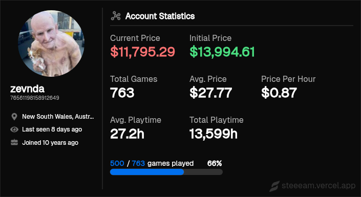
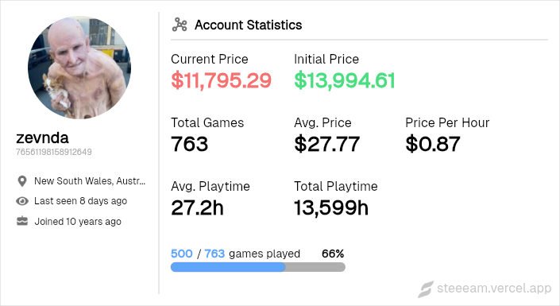
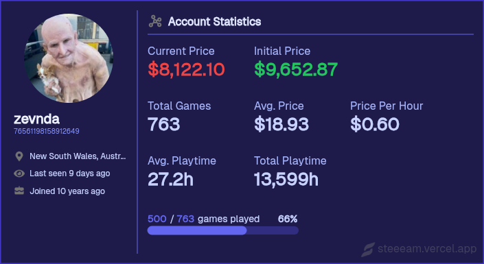

<div align="center">
    <h1 align="center">
        Steeeam - Visualize your Steam account
    </h1>
    <p align="center">
        Calculate your game library value, total playtime, average game cost, and more. Dynamically generate a shareable card to brag (or cry) about your collection on Discord, GitHub, and other platforms.
    </p>
    
</div>

# Steeeam card
Dynamically generate your Steeeam card directly in places like Discord channels, GitHub markdown files, Twitter posts, and more.

### Discord
```
https://steeeam.vercel.app/api/<steam_username_or_id>
```

### Twitter, Facebook, WhatsApp, etc..
```
https://steeeam.vercel.app/<steam_username_or_id>
```

### GitHub and other `.md` and `.mdx` files
```
[](https://steeeam.vercel.app)
```

### HTML
```
<a href="https://steeeam.vercel.app/<steam_username_or_id>">" alt="Generate by Steeeam"/></a>
```

### BBCode
```
[url=https://steeeam.vercel.app/<steam_username_or_id>][img alt="Generate by Steeeam"]https://steeeam.vercel.app/api/<steam_username_or_id>[/img][/url]
```

# Customize your Steeeam card
Personalize every aspect of your Steeeam card by appending any of the options below, or browse the [preset themes](https://github.com/zevnda/steeeam?tab=readme-ov-file#preset-themes) below.

### Options
| Name              | Description                                              | Type                                               | Default value |
| ----------------- | -------------------------------------------------------- | -------------------------------------------------- | ------------- |
| `country_code`    | Display currency values for this country code.           | [alpha-2 code](https://www.iban.com/country-codes) | `us`          |
| `bg_color`        | Card's background color.                                 | string (hex color)                                 | `0b0b0b`      |
| `title_color`     | Card's title color.                                      | string (hex color)                                 | `ffffff`      |
| `sub_title_color` | Body sub-title color.                                    | string (hex color)                                 | `adadad`      |
| `text_color`      | Body text color.                                         | string (hex color)                                 | `ffffff`      |
| `username_color`  | Steam username text color.                               | string (hex color)                                 | `ffffff`      |
| `id_color`        | Steam ID text color.                                     | string (hex color)                                 | `adadad`      |
| `cp_color`        | Current price text color.                                | string (hex color)                                 | `f87171`      |
| `ip_color`        | Initial price text color.                                | string (hex color)                                 | `4ade80`      |
| `div_color`       | Body divider color.                                      | string (hex color)                                 | `ffffff`      |
| `border_color`    | Card's border color.                                     | string (hex color)                                 | `ffffff30`    |
| `border_width`    | Card's border width.                                     | number (0-10)                                      | `1`           |
| `hide_border`     | Hide the card's border                                   | boolean                                            | `false`       |
| `progbar_bg`      | Progress bar background color.                           | string (hex color)                                 | `ffffff30`    |
| `progbar_color`   | Progress bar foreground color.                           | string (hex color)                                 | `006fee`      |
| `theme`           | Choose from 'light' or 'dark'. *(Overrides all options)* | enum                                               | `dark`        |

### Examples
```
https://steeeam.vercel.app/api/zevnda?theme=dark
```


```
https://steeeam.vercel.app/api/zevnda?theme=light
```


```
https://steeeam.vercel.app/api/zevnda?bg_color=1e1b4b&title_color=e0e7ff&sub_title_color=a5b4fc&text_color=c7d2fe&username_color=eef2ff&id_color=818cf8&cp_color=ef4444&ip_color=22c55e&div_color=6366f1&border_color=4338ca&border_width=3&progbar_bg=312e81&progbar_color=6366f1
```


# Preset Themes

### Dusk

```
https://steeeam.vercel.app/api/zevnda?bg_color=282c34&title_color=f0f8ff&text_color=e6f0ff&sub_title_color=61dafb&border_color=4b5563&border_width=5&progbar_bg=4b5563&progbar_color=61dafb
```


### Forest

```
https://steeeam.vercel.app/api/zevnda?bg_color=1a241b&title_color=d1c9af&text_color=c8e6c9&sub_title_color=689f38&border_color=33691e&border_width=5&progbar_bg=33691e&progbar_color=689f38
```


### Ocean

```
https://steeeam.vercel.app/api/zevnda?bg_color=293f50&title_color=e0f2f7&text_color=c8e6c9&sub_title_color=4fc3f7&border_color=2962ff&border_width=5&progbar_bg=2962ff&progbar_color=4fc3f7
```


### Steampunk

```
https://steeeam.vercel.app/api/zevnda?bg_color=2b2821&title_color=d6b888&text_color=e5d5b8&sub_title_color=c17f59&border_color=785e3a&border_width=5&progbar_bg=463521&progbar_color=bf8756
```


### Pastel

```
https://steeeam.vercel.app/api/zevnda?bg_color=f0e6ef&title_color=7c7287&text_color=9c89b8&sub_title_color=b8bedd&border_color=dabfde&border_width=5&progbar_bg=a7abde&progbar_color=c8ceee&username_color=9c89b8&id_color=b8bedd&cp_color=ff9f9f&ip_color=95ceff
```


### Mint

```
https://steeeam.vercel.app/api/zevnda?bg_color=2d3e40&title_color=7de0bb&text_color=b2ded4&sub_title_color=5ec4a6&border_color=466d66&border_width=5&progbar_bg=394f4d&progbar_color=64a694
```


### Synthwave

```
https://steeeam.vercel.app/api/zevnda?bg_color=2b1b2c&title_color=ff8c94&text_color=ffb6b9&sub_title_color=ff5f7e&border_color=c1436d&border_width=5&progbar_bg=4c2a4f&progbar_color=ea526f
```


### Emerald

```
https://steeeam.vercel.app/api/zevnda?bg_color=004b49&title_color=7bae7f&text_color=95d5b2&sub_title_color=52b788&border_color=2d6a4f&border_width=5&progbar_bg=1b4332&progbar_color=40916c
```


### Nordic

```
https://steeeam.vercel.app/api/zevnda?bg_color=eff6ff&title_color=2c3639&text_color=3d4f53&sub_title_color=7a97a5&border_color=dde6ed&border_width=5&progbar_bg=a5c0cd&progbar_color=7a97a5&username_color=596e76&cp_color=5ca9bf&ip_color=5ca9bf
```


### Deep Space

```
https://steeeam.vercel.app/api/zevnda?bg_color=0f172a&title_color=e2e8f0&sub_title_color=94a3b8&text_color=cbd5e1&username_color=f8fafc&id_color=64748b&cp_color=ef4444&ip_color=4ade80&div_color=475569&border_color=334155&border_width=3&progbar_bg=1e293b&progbar_color=3b82f6
```


### Vanilla

```
https://steeeam.vercel.app/api/zevnda?bg_color=fef3c7&title_color=854d0e&sub_title_color=a16207&text_color=78350f&username_color=451a03&id_color=92400e&cp_color=b91c1c&ip_color=15803d&div_color=9a3412&border_color=d97706&border_width=3&progbar_bg=fbbf24&progbar_color=b45309
```


### Ruby

```
https://steeeam.vercel.app/api/zevnda?bg_color=881337&title_color=fce7f3&sub_title_color=f9a8d4&text_color=fbcfe8&username_color=fdf2f8&id_color=f472b6&cp_color=ff5252&ip_color=86efac&div_color=db2777&border_color=be185d&border_width=3&progbar_bg=9d174d&progbar_color=ec4899
```


### Lavender

```
https://steeeam.vercel.app/api/zevnda?bg_color=eef2ff&title_color=3730a3&sub_title_color=4f46e5&text_color=312e81&username_color=1e1b4b&id_color=4338ca&cp_color=dc2626&ip_color=16a34a&div_color=6366f1&border_color=818cf8&border_width=3&progbar_bg=c7d2fe&progbar_color=4f46e5
```


### Rose

```
https://steeeam.vercel.app/api/zevnda?bg_color=fff1f2&title_color=881337&sub_title_color=be123c&text_color=9f1239&username_color=4c0519&id_color=e11d48&cp_color=dc2626&ip_color=16a34a&div_color=fb7185&border_color=fda4af&border_width=3&progbar_bg=ffe4e6&progbar_color=f43f5e
```


### Volcanic

```
https://steeeam.vercel.app/api/zevnda?bg_color=7f1d1d&title_color=fee2e2&sub_title_color=fca5a5&text_color=fecaca&username_color=fef2f2&id_color=f87171&cp_color=ff6c6c&ip_color=76ca80&div_color=ef4444&border_color=991b1b&border_width=3&progbar_bg=b91c1c&progbar_color=f87171
```


### Twilight

```
https://steeeam.vercel.app/api/zevnda?bg_color=1e1b4b&title_color=e0e7ff&sub_title_color=a5b4fc&text_color=c7d2fe&username_color=eef2ff&id_color=818cf8&cp_color=ef4444&ip_color=22c55e&div_color=6366f1&border_color=4338ca&border_width=3&progbar_bg=312e81&progbar_color=6366f1
```


### Vintage

```
https://steeeam.vercel.app/api/zevnda?bg_color=f5e6d3&title_color=4c2c11&sub_title_color=8b572a&text_color=66391b&username_color=2b1810&id_color=a66b38&cp_color=b91c1c&ip_color=15803d&div_color=d4a373&border_color=deb187&border_width=2&progbar_bg=ede0d4&progbar_color=a66b38
```


### Cotton Candy

```
https://steeeam.vercel.app/api/zevnda?bg_color=fdf2f8&title_color=831843&sub_title_color=be185d&text_color=9d174d&username_color=500724&id_color=db2777&cp_color=e11d48&ip_color=16a34a&div_color=ec4899&border_color=fbcfe8&border_width=3&progbar_bg=fce7f3&progbar_color=db2777
```


### Black/Gold

```
https://steeeam.vercel.app/api/zevnda?bg_color=0f0f0f&title_color=ffd700&sub_title_color=c5a572&text_color=e5c890&username_color=ffd700&id_color=c5a572&cp_color=ff4545&ip_color=4ade80&div_color=c5a572&border_color=ffd700&border_width=3&progbar_bg=2b2617&progbar_color=ffd700
```


